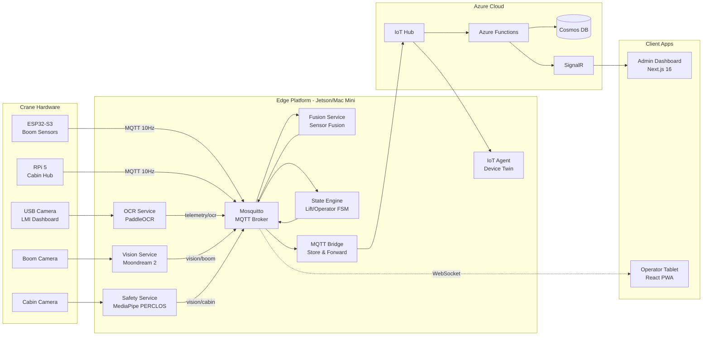

# MOSY — Mobile Crane Operator Safety & Productivity System

A full-stack IoT platform for real-time crane monitoring, operator safety, and fleet management. Edge AI processes camera feeds for dashboard OCR, load zone awareness, and fatigue detection — all running offline-first on the crane itself.

## Architecture



## Quick Start

```bash
# Clone
git clone https://github.com/vaidyanathan1405/mosy-crane-iot.git
cd mosy-crane-iot

# Install dependencies
pnpm install

# Run the full demo (Docker + Dashboard with simulated data)
pnpm demo

# Open http://localhost:3000 — Admin Dashboard in demo mode
```

### Individual Commands

| Command | Description |
|---------|-------------|
| `pnpm demo` | Start full demo environment (edge services + dashboard) |
| `pnpm simulate` | Run standalone sensor simulator (7 scenarios) |
| `pnpm validate` | Run POC validation test suite |
| `pnpm dev` | Start all apps in development mode |
| `pnpm build` | Build all packages and apps |
| `pnpm test` | Run all test suites |
| `pnpm lint` | Lint all TypeScript and Python code |

## Tech Stack

| Layer | Technology | Version |
|-------|-----------|---------|
| Admin Dashboard | Next.js (App Router) | 16.x |
| Operator Tablet | React + Vite PWA | 19.x / 6.x |
| Styling | Tailwind CSS | 4.1 |
| Components | shadcn/ui | latest |
| Charts | Recharts | 3.7 |
| Auth | Microsoft Entra ID (MSAL) | 5.1.0 |
| Cloud DB | Azure Cosmos DB | SQL API |
| Cloud Functions | Azure Functions v4 | Node.js 22 |
| Real-time | Azure SignalR | Standard |
| IoT | Azure IoT Hub | S1 |
| Dashboard OCR | PaddleOCR | 3.x |
| Vision AI | Moondream 2 VLM | 0.5B INT8 |
| Fatigue Detection | MediaPipe Face Mesh | 0.10.x |
| Edge Runtime | Docker Compose | Ubuntu 22.04 |
| MQTT Broker | Eclipse Mosquitto | 2.x |
| Boom Firmware | ESP-IDF / Arduino | C++ |
| Cabin Hub | Python | paho-mqtt 1.6.1 |
| Infrastructure | Azure Bicep | IaC |
| CI/CD | GitHub Actions | 6 workflows |

## Project Structure

```
mosy-crane-iot/
├── apps/
│   ├── admin-dashboard/        # Next.js 16 — fleet management UI
│   ├── tablet-pwa/             # React PWA — operator HUD + stats
│   └── edge/
│       ├── services/           # 8 Python Docker services
│       │   ├── ocr-service/    #   PaddleOCR dashboard reader
│       │   ├── vision-service/ #   Moondream 2 boom analyzer
│       │   ├── safety-service/ #   MediaPipe PERCLOS fatigue
│       │   ├── fusion-service/ #   Multi-sensor data fusion
│       │   ├── state-engine/   #   Lift/operator state machines
│       │   ├── mqtt-bridge/    #   Store-and-forward to Azure
│       │   └── iot-agent/      #   Azure IoT Device SDK
│       ├── docker-compose.yml
│       ├── Dockerfile.base     # Core services image
│       └── Dockerfile.ai       # AI services image
├── firmware/
│   ├── esp32-boom/             # ESP32-S3 boom sensor unit (C++)
│   └── rpi5-cabin/             # RPi 5 cabin aggregator (Python)
├── packages/
│   ├── shared-types/           # TypeScript type definitions
│   └── mqtt-schemas/           # MQTT message schemas
├── functions/                  # 8 Azure Functions
├── infra/
│   ├── bicep/                  # Azure IaC templates
│   └── monitoring/             # Prometheus + Grafana stack
├── tools/
│   └── sensor-simulator/       # Standalone MQTT simulator (7 scenarios)
├── tests/
│   └── e2e/                    # Integration tests
├── scripts/
│   ├── demo-start.sh           # One-command demo startup
│   ├── download_models.sh      # Download AI models
│   └── poc-validate.sh         # POC validation suite
└── MOSY_BLUEPRINT.md           # Full system specification
```

## Edge Services

All 8 services run as Docker containers on the crane's edge computer, communicating via MQTT:

| Service | Port | Purpose |
|---------|------|---------|
| Mosquitto | 1883 / 9001 | MQTT broker (TCP + WebSocket) |
| Fusion Service | 8083 | Multi-sensor data fusion + cross-validation |
| OCR Service | 8084 | PaddleOCR reads crane LMI display |
| State Engine | 8085 | Lift lifecycle + operator state machines |
| IoT Agent | 8086 | Azure IoT Hub device twin + direct methods |
| Vision Service | 8087 | Moondream 2 VLM analyzes boom camera |
| Safety Service | 8088 | MediaPipe PERCLOS fatigue detection |
| MQTT Bridge | 8081 | SQLite store-and-forward to Azure |

## Demo Mode

The system includes a full demo mode with simulated sensor data for demonstrations without physical hardware:

```bash
pnpm demo
# Starts: Docker edge services + sensor simulator + Next.js dashboard
# Open: http://localhost:3000
```

The sensor simulator supports 7 scenarios:
- `normal` — Standard crane operation
- `overload` — Load capacity warning → critical
- `fatigue` — Operator drowsiness detection
- `wind-gust` — Wind speed exceeds limits
- `ocr-failure` — Camera feed loss + recovery
- `disconnect` — Network interruption + reconnect
- `full-demo` — 5-minute comprehensive timeline (all scenarios)

## Testing

332 tests across all components:

```bash
pnpm test              # All TypeScript tests (vitest)
cd apps/edge && pytest # All edge service tests (pytest)
cd firmware/rpi5-cabin && pytest  # Firmware tests
```

| Component | Tests | Framework |
|-----------|-------|-----------|
| Edge Services | 115 | pytest |
| Admin Dashboard | 94 | vitest |
| Operator Tablet | 79 | vitest |
| RPi 5 Firmware | 41 | pytest |
| E2E Integration | 3 | pytest |

## Specification

For complete system specification including MQTT topics, database schemas, API contracts, and hardware specifications, see [MOSY_BLUEPRINT.md](MOSY_BLUEPRINT.md).

## License

UNLICENSED — Proprietary software. All rights reserved by Department of Information Technology, Thiagarajar College of Engineering.
